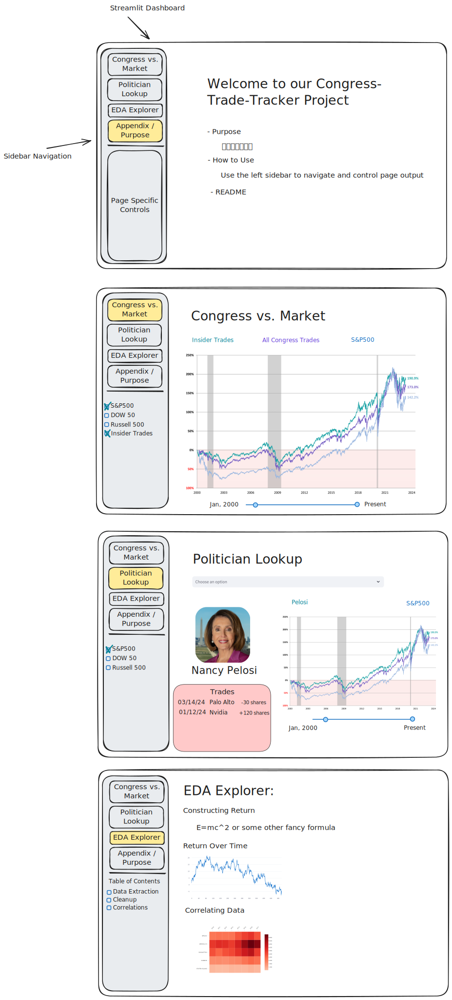

# RESEARCH PROPOSAL: Performance of Potential Congressional Insider Trades vs. S&P 500

## By Adrian Ross, Hana Dinh, Alexander Weissman, Evan DeBlase

### Research Question

In this research, we are exploring the relationship between trading activities we have classified as insider trading by Congress members and the performance of the stocks involved. Our hypothesis is that Congressional insider trading will consistently outperform the S&P 500.

#### Dashboard

To accomplish this, our dashboard will consist of 4 pages:

1. **Performance of the S&P 500 vs. all Congress trades vs. Congress trades classified as insider trading**
   - Trades are classified as insider trading if the person makes the trade on a stock belonging to the industry committee that they are sitting on.
2. **How to use/Appendix**
3. **EDA**
   - How long does each Congress member hold the position typically?
   - Comparison of the performance between the two parties and between Congressional members (who makes the best trades?)
   - Does their trading behavior coincide with any legislative changes? What is the average time difference between their trades and the release of new bills?
   - How do market participants react to news or disclosures related to Congress members' trading activities? (i.e. Is there a spike in stock price after the trades are reported? How do market volatility and trading volume change in response to Congress trades?
   - How do the volume and frequency of trades vary over time?
   - How do the returns of trades classified as insider trading compare to non-insider trades?
4. **Trade analysis of individual Congress members** (drop-down menu for selecting individual Congress members)

### Necessary Data

- **Congress Trades Data**: Information on trades made by members of Congress.
  - **Source:** [Senate Stock Watcher API](https://senatestockwatcher.com/api)
- **S&P 500 Performance Data**: Closing prices of GSPC for calculating the daily cumulative returns.
  - **Source:** Yahoo Finance
- **Committee Membership Data**: The industry committees on which each Congress member serves for classifying trades as insider trading.
  - **Source:** [House of Representatives](https://www.house.gov/representatives) and [Senate Committees](https://www.senate.gov/committees/membership.htm)

#### Final Datasets

| Dataset                         | Observation                                           | Sample Period                 | Sample Conditions                           | Necessary Variables                                                                                              |
|---------------------------------|-------------------------------------------------------|-------------------------------|---------------------------------------------|-----------------------------------------------------------------------------------------------------------------|
| **Daily Cumulative Returns for the S&P 500** | Each row represents the cumulative returns of the S&P 500 index up to the corresponding date. | 10 years before to the project’s due date (April 30, 2014 - Present) | None                                    | Date, S&P 500 Return, S&P 500 cumulative return                                                                |
| **Individual Trades per Congress Member**    | Each row represents a single trade made by a Congress member.                     | Same as above                 | Don’t include trades made outside of our sample period | Congress Member, Party Affiliation, Trade Date, Stock Traded (ticker), Trade Volume, Trade Amount, Trade Type (buy/sell), gsector, Committee(s) Served, Insider Trading Flag |
| **Daily Cumulative Returns of All Trades per Congress Member** | Each row represents the cumulative returns of all trades made by a specific Congress member up to the corresponding date. | Same as above                 | Don’t include returns for trades made outside of our sample period | Congress Member, Date, Daily Return, Daily Cumulative Return, Committee(s) served                                |
| **Daily Cumulative Returns of Insider Trades per Congress Member** | Each row represents the cumulative returns of insider trades made by a specific Congress member up to the corresponding date. | Same as above                 | Same as above                            | Congress Member, Date, Daily Return (Insider), Cumulative Daily Return (Insider), Insider Trading Flag           |

#### Data Transformation

**Step 1: Prepare and Clean Data**
- Clean the data: Ensure critical columns have no missing values. For date columns, ensure they are in a consistent date format. Cleanse ticker symbols and names for uniformity.

**Step 2: Calculate Daily Cumulative Returns for the S&P 500**
- Filter `sp500_daily_price.csv` for the required date range (April 30, 2014 - Present).
- Calculate daily returns using the adjusted closing price. The daily return can be calculated using the formula: `Daily Return = (Price_t - Price_t-1) / Price_t-1`
- Calculate cumulative returns: Cumulate the daily returns using a cumulative sum function.

**Step 3: Analyze Individual Trades per Congress Member**
- Combine `house_representatives.csv` and `senate_representatives.csv` into a single `congress_members.csv` dataset.
- Merge `individual_trades.csv` with `congress_members.csv` to associate each trade with a congress member's details, particularly the committee.
- Filter trades within the required date range.
- Determine insider trading flag: If the committee matches gsector, flagged as insider trading.

**Step 4: Calculate Cumulative Returns of All Trades Per Congress Member**
- Calculate daily returns for each stock traded by Congress members using `daily_stocks_prices.csv`.
- Aggregate these daily returns per Congress member: This involves grouping data by Congress member and date and summing up all individual stock returns for that day.
- Calculate cumulative returns for each Congress member over time.

**Step 5: Cumulative Returns of Insider Trades Per Congress Member**
- Filter the trades dataset for insider trades based on the insider trading flag.
- Repeat steps similar to Step 4, but only for the filtered insider trades dataset.

### Dashboard Mockup

### Resources
- [The Unusual Whales Congress Trading Report for 2023](https://unusualwhales.com/politics/article/congress-trading-report-2023)
- [Tracking Congress Stock Trades In Python](https://entreprenerdly.com/tracking-congress-stock-trades-in-python/)
- [Stock Trades Reported by Nearly a Fifth of Congress Show Possible Conflicts](https://www.nytimes.com/interactive/2022/09/13/us/politics/congress-stock-trading-investigation.html)
